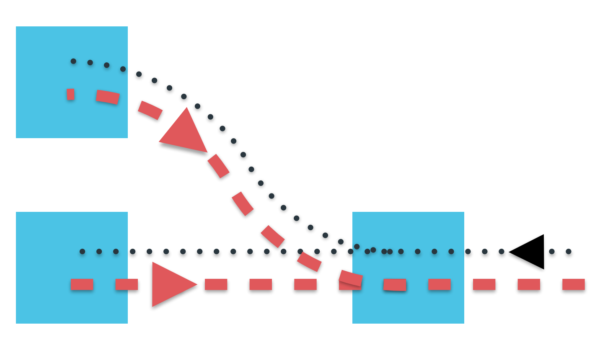

Scraping Reddit with Akka Streams 1.0
=====================================


**Assertion**: A large part of today's tech industry can be described as some combination of sending, transforming and consuming streams of data. A few quick examples:
- Streaming audio and video are quickly replacing legacy media delivery systems like video rental and broadcast TV.
  + Netflix alone has been measured using 35% percent of the US's downstream internet bandwidth during peak hours. 
- A significant fraction of startups and established companies produce, transform or consume streams of market data, analytics data, log events, tweets, or data from networked sensors.
- Big data, the buzzword of our times, largely boils down to sequences of map & reduce steps, which can easily be expressed as transformations and combinations of streams of data. 
  + Writing jobs as stream processing pipelines adds flexibility. For example, Twitter uses a library called Summingbird to transform high-level stream processing steps into either real-time stream processing graphs using Storm or batch-processing jobs using Hadoop.
- And speaking of the Internet:
  + TCP itself is just a way of sending ordered streams of packets between hosts
  + UDP is another way to send streams of data, without TCP's ordering or delivery guarantees


Reactive Streams
----------------


The Reactive Streams standard defines an upstream demand channel and a downstream data channel. Publishers do not send data until a request for N elements arrives via the demand channel, at which point they are free to push up to N elements downstream either in batches or individually. When outstanding demand exists, the publisher is free to push data to the subscriber as it becomes available. When demand is exhausted, the publisher cannot send data except as a response to demand signalled from downstream. This lack of demand, or backpressure, propagates upstream in a controlled manner, allowing the source node to choose between starting up more resources, slowing down, or dropping data.


What's cool is that since data and demand travel in opposite directions, merging streams splits the upstream demand and splitting streams merges the downstream demand.




The Code
--------
RS is defined by the following minimal, heavily tested, set of interfaces.
```Scala
trait Publisher[T] {
  def subscribe(s: Subscriber[T]): Unit
}

trait Subscriber[T] {
    def onSubscribe(s: Subscription): Unit
    def onNext(t: T): Unit
    def onError(t: Throwable): Unit
    def onComplete(): Unit
}

trait Subscription {
   def request(n: Unit): Unit
   def cancel(): Unit
}
```

This is great, but it's all very low level. Look at all those Unit return types! Fortunately, there's a domain-specific language for transforming and composing stream processing graphs.

Akka Streams:
--------------------------

Akka Streams has two major components: 
+ A high-level, type safe DSL for creating descriptions of stream processing graphs.
+ Machinery for transforming these descriptions into live stream processing graphs backed by Akka actors and implementing the Reactive Streams standard.


We're going to use Akka Streams to count the number of times words are used in commments on each of the most popular sub-forums on Reddit. (Recap: Reddit is structured with subreddits at the top level. Users can post links to subreddits and add comments to links. Links and comments can be voted 'up' or 'down' by users.) We're going to use Reddit's API to get a list of popular subreddits, get a list of popular links for each subreddit, and then get popular comments for each link. Finally, we'll persist word counts for the comments of each subreddit.


Let's start with an overview of the types we'll be working with.

**Scala Futures**:

You can skip this paragraph if you're already familiar with Scala's Future class. If not, a Future[T] is an object holding a value of type T which may become available at some point. This value is usually the result of some other computation. For example: `def execute(req: HttpRequest)(implicit ec: ExecutionContext): Future[HttpResponse]` is a function that executes an `HttpRequest` and, instead of blocking until a response is received, immediately returns a `Future[HttpResponse]`. (The `implicit ec: ExecutionContext` parameter provides a thread pool for executing callbacks on futures, which is outside the scope of this post)

**Reddit API**:

```Scala
type WordCount = Map[String, Int]
case class LinkListing(links: Seq[Link])
case class Link(id: String, subreddit: String)
case class CommentListing(subreddit: String, comments: Seq[Comment])
case class Comment(subreddit: String, body: String)

trait RedditAPI {
  def popularLinks(subreddit: String)(implicit ec: ExecutionContext): Future[LinkListing]
  def popularComments(link: Link)(implicit ec: ExecutionContext): Future[CommentListing]
  def popularSubreddits(implicit ec: ExecutionContext): Future[Seq[String]]
}
```

Sources
-------

An instance of the type `Source[Out]` produces a potentially unbounded stream of elements of type `Out`. We'll start by creating a stream of subreddit names, represented as Strings.

Sources can be created from Vectors (an indexed sequence roughly equivalent to an Array).
```Scala
val subreddits: Source[String] = Source(args.toVector)
```

Try it out:
```Scala
import com.pkinsky.Main._
import akka.stream.scaladsl._
Source(Array("funny", "sad").toVector).runForeach(println)
```
As expected:
```
funny
sad
```


Single-element sources can also be created from Futures, resulting in a Source that emits the result of the future if it succeeds or fails if the future fails.

```Scala
val subreddits: Source[String] = Source(RedditAPI.popularSubreddits).mapConcat(identity)
```

Since `popularSubreddits` creates a `Future[Seq[String]]`, we take the additional step of using `mapConcat` to flatten the resulting `Source[Seq[String]]` into a `Source[String]`. `mapConcat` 'Transforms each input element into a sequence of output elements that is then flattened into the output stream'. Since we already have a `Source[Seq[T]]`, we just pass the identity function to mapConcat.


Try it out:
```Scala
import akka.stream.scaladsl._
import com.pkinsky._
import Main._
Source(RedditAPI.popularSubreddits).mapConcat(identity).runForeach(println)
```

This outputs:
```
--> started fetch popular subreddits at t0 + 608
	<-- finished fetch popular subreddits after 166 millis
funny
AdviceAnimals
pics
aww
todayilearned
```
2 out of the top 5 subreddits are  dedicated to pictures of cute animals (AdviceAnimals and aww). Insight!


Sinks
-----

A `Sink[In]` consumes elements of type `In`. Some sinks produce values on completion. For example, ForeachSinks produce a Future[Unit] that completes when the stream completes. FoldSinks, which fold some number of elements of type `A` into an initial value of type `B` using a function `(A, B) => B`, produces a `Future[B]` that completes when the stream completes.

This sink takes a stream of comments, converts them into (subreddit, wordcount) pairs, and merges those pairs into a `Map[String, WordCount]` that can be retrieved on stream completion

```Scala
val wordCountSink: FoldSink[Map[String, WordCount], Comment] =
  FoldSink(Map.empty[String, WordCount])(
    (acc: Map[String, WordCount], c: Comment) =>
      mergeWordCounts(acc, Map(c.subreddit -> c.toWordCount))
  )
```

This one's a bit harder to test. Instead of producing a stream of items that we can consume and print, it consumes comments and folds them together to produce a single value.  
```Scala
import akka.stream.scaladsl._
import com.pkinsky._
import Main._
import scala.concurrent.Future
val comments = Vector(Comment("news", "hello world"), 
                      Comment("news", "cruel world"), 
                      Comment("funny", "hello world"))
val f: Future[Map[String, WordCount]] = Source(comments).runWith(wordCountSink)
f.onComplete(println)
```

The future completes succesfully when the Sink finishes processing the last element produced by the Source, resulting in:
```
Success(Map(funny -> Map(world -> 1, hello -> 1), news -> Map(world -> 2, cruel -> 1, hello -> 1)))
```


Flows
-----

A `Flow[In, Out]` consumes elements of type `In`, applies some sequence of transformations, and emits elements of type `Out`.

This Flow takes subreddit names and emits popular links for each supplied subreddit name.
- We start by creating a `Flow[String, String]`, a pipeline that applies no transformations.
- We use via to append a throttle Flow.
    + We'll define throttle in the next section. For now, just think of it as a black box `Flow[T, T]` that limits throughput to one message per redditAPIRate time units.
- Next we use mapAsyncUnordered to fetch popular links for each subreddit name emitted by the throttle.
    + mapAsyncUnordered is used here because we don't care about preserving ordering. It emits elements as soon as their Future completes, which keeps the occasional long-running call from blocking the entire stream.
- Finally, we use mapConcat to flatten the resulting stream of LinkListings into a stream of Links.

```Scala
  val fetchLinks: Flow[String, Link] =
    Flow[String]
    .via(throttle(redditAPIRate))
    .mapAsyncUnordered( subreddit => RedditAPI.popularLinks(subreddit) )
    .mapConcat( listing => listing.links )
```

Let's test this out! Here we create a source using 4 subreddit names, pipe it through `fetchLinks`, and use runForeach to consume and print each element emitted by the resulting `Source`.
```Scala
import akka.stream.scaladsl._
import com.pkinsky.Main._
Source(Vector("funny", "sad", "politics", "news")).via(fetchLinks).runForeach(println)
```

This outputs:
```
--> started links: r/funny/top at t0 + 193
--> started links: r/sad/top at t0 + 486
	<-- finished links: r/funny/top after 305 millis
Link(202wd3,funny)
(more links...)
Link(15jrds,funny)
	<-- finished links: r/sad/top after 228 millis
Link(2hasrr,sad)
(more links...)
Link(w346r,sad)
--> started links: r/politics/top at t0 + 996
	<-- finished links: r/politics/top after 349 millis
Link(1ryfk0,politics)
(more links...)
Link(1wxyyi,politics)
--> started links: r/news/top at t0 + 1495
	<-- finished links: r/news/top after 141 millis
Link(2kp34z,news)
(more links...)
Link(2ooscv,news)
```
Note how about 500 milliseconds elapse between each fetch links call (193, 486, 996 and 1495 milliseconds) due to the throttle. As each call completes with a LinkListing, the pipeline emits a batch of Link objects.


This flow uses the same sequence of steps (with a different API call) to convert a stream of links into a stream of the most popular comments on those links.
```Scala
val fetchComments: Flow[Link, Comment] =
  Flow[Link]
    .via(throttle(redditAPIRate))
    .mapAsyncUnordered( link => RedditAPI.popularComments(link) )
    .mapConcat( listing => listing.comments )
```

Let's test this flow with one of the links outputted by the previous test. 
```Scala
import akka.stream.scaladsl._
import com.pkinsky._
import Main._
Source(Vector(Link("2ooscv","news"))).via(fetchComments).runForeach(println)
```
`Source(Vector(Link("2ooscv","news")))` emits a single link that maps to this article: [Illinois General Assembly passes bill to ban citizens from recording police](http://www.illinoispolicy.org/illinois-general-assembly-revives-recording-ban/). Piping that source through the `fetchComments` flow creates a Source[Comment] that fetches and emits the top comments on that link:

```
--> started comments: r/news/2ooscv/comments at t0 + 615
	<-- finished comments: r/news/2ooscv/comments after 6104 millis
Comment(news,Ah i am sure it will be overturned eventually.  What a waste of money and time.)
Comment(news,If you can't stop police from murdering people, stop people from finding out about it. )
Comment(news,If nobody videotapes the beatings, morale will definitely improve!)
(...many more comments)
```

Graphs
------


Not everything can be expressed as a linear sequence of stream processing steps. The Akka Streams DSL provides tools for building stream processing graphs with stream processing nodes that have multiple inputs and outputs. In this case, we want to zip a fast stream together with a slow one, to throttle the throughput of the fast stream to that of the the slow one. 
 - Graphs can be complete or partial, with partial graphs having undefined sources, sinks or both.
 - Complete graphs can be run as-is. 

First, here's the type signature of throttle: `def throttle[T](rate: FiniteDuration): Flow[T, T]`. The flow graph creation syntax can be a bit hard to follow, so to start here's a flowchart showing the structure of the stream processing step we're going to build.  
```
    +------------+
    | tickSource +-Unit-+
    +------------+      +---> +-----+            +-----+      +-----+
                              | zip +-(T,Unit)-> | map +--T-> | out |
    +----+              +---> +-----+            +-----+      +-----+
    | in +----T---------+
    +----+
```

And the code:
```Scala
def throttle[T](rate: FiniteDuration): Flow[T, T] = {
  val tickSource = TickSource(rate, rate, () => () )
  val zip = Zip[T, Unit]
  val in = UndefinedSource[T]
  val out = UndefinedSink[(T, Unit)]
  PartialFlowGraph{ implicit builder =>
    import FlowGraphImplicits._
    in ~> zip.left
    tickSource ~> zip.right
    zip.out ~> out
  }.toFlow(in, out).map{ case (t, _) => t }
}
```

Let's test it out:
```Scala
import akka.stream.scaladsl._
import com.pkinsky._
import Main._
import scala.concurrent.duration._
Source((1 to 10).toVector).via(throttle[Int](500 millis)).runForeach{ n => println(s"$n @ ${System.currentTimeMillis}")}
```
yields:
```
1 @  1421640216506
2 @  1421640217006
3 @  1421640217506
4 @  1421640218006
5 @  1421640218507
```

Just for fun, let's remove the throttle:
```Scala
import akka.stream.scaladsl._
import com.pkinsky.Main._
Source((1 to 1000).toVector).runForeach{ n => println(s"$n @ ${System.currentTimeMillis}")}
```
Without the throttle, 1000 elements are consumed within 64 ms.
```
1 @ 1421641414420
...
1000 @ 1421641414484
```


Finally, we combine these steps to create a description of a stream processing graph, which we materialize and run with .runWith().

```Scala
val res: Future[Map[String, WordCount]] =
  subreddits
    .via(fetchLinks)
    .via(fetchComments)
    .runWith(wordCountSink)

res.onComplete(writeResults)
```


Conclusion
----------

- We started by defining small pipeline segments like throttle, used them to build larger pipeline segments such as fetchLinks and fetchComments, then used these larger segments to create our stream processing graph. These smaller stream processing segments are immutable, thread safe, and fully reusable. They could easily be stored statically, on some object, to avoid the overhead of repeated initialization.
- Akka Streams is a great tool that can (and should) be used for more complex problems.
- Resources:
  + [Akka Streams Cookbook](http://doc.akka.io/docs/akka-stream-and-http-experimental/1.0-M2/scala/stream-cookbook.html)
  + [Reactive Streams: Handling Data-Flows the Reactive Way (great talk by Roland Kuhn. Some of the above graphics are taken from this talk's slides) )](http://www.infoq.com/presentations/reactive-steams-akka)
